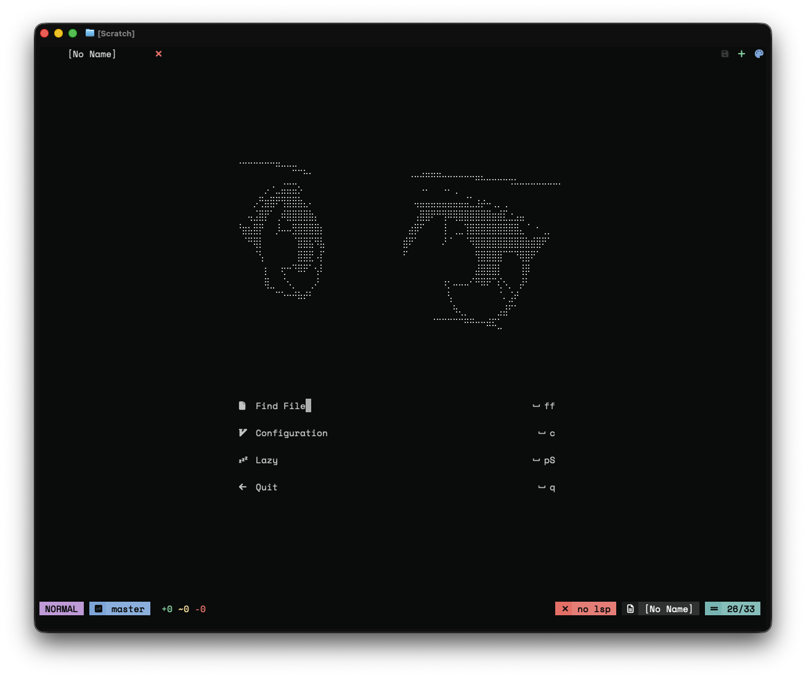
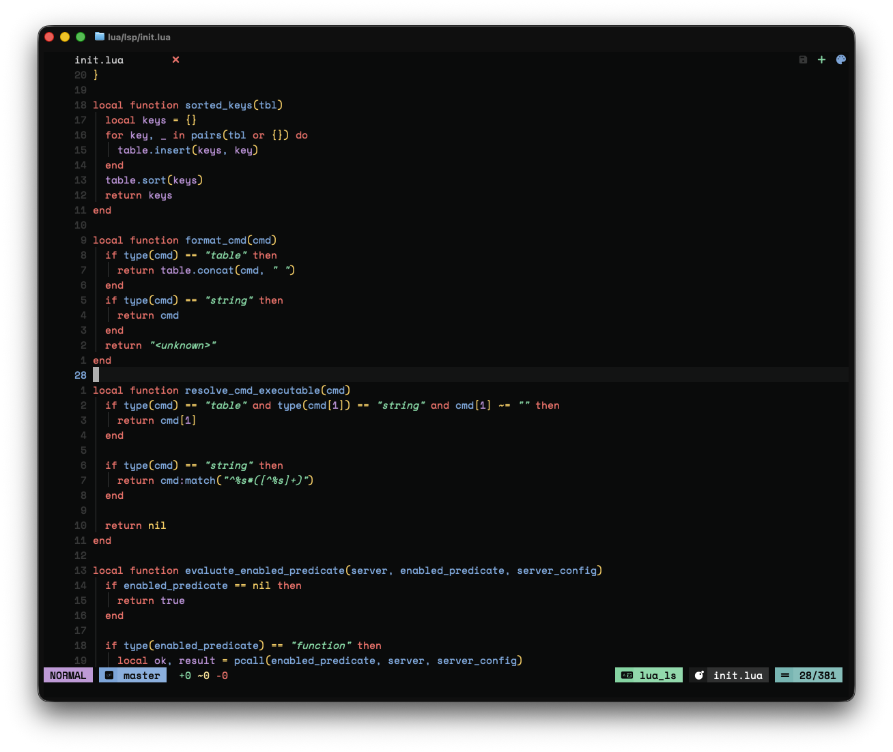

## neov - an exceptionally bad neovim config

  
  

### Custom UI

- custom colorscheme with presets, highlights and terminal colors
- statusline with mode, git, diff, LSP, file and cursor position
- tabline/bufferline with clickable tabs, save, new tab and theme switcher
- startup dashboard with shortcuts
- centered floating terminal

### Maps

| key | action |
| --- | --- |
| `<leader>s` | save |
| `<leader>t` | new buffer |
| `<leader>ff` | find files |
| `<leader>fp` | live grep |
| `/` | floating search |
| `<C-j>` | floating terminal |
| `<leader>td` | toggle inline diagnostics |
| `<C-1>`..`<C-9>` | switch to listed buffer |
| `<A-j>` / `<A-k>` | move line or block |
| `<leader>wv` / `<leader>wh` | split vertical / horizontal |
| `<leader>we` / `<leader>wq` | equalize / close window |
| `gK` | open documentation |
| `<leader>fd` | search documentation |
| `<leader>fs` | show symbol signature |

### Plugins

- `nvim-web-devicons`
- `Comment.nvim`
- `nvim-treesitter`
- `telescope.nvim` with `plenary.nvim`
- `gitsigns.nvim`
- `indent-blankline.nvim` with `mini.indentscope`
- `nvim-colorizer.lua`
- `conform.nvim`
- `nvim-cmp` with `cmp-nvim-lsp`, `cmp-buffer` and `colorful-menu.nvim`

### LSP

servers:

- `clangd`
- `eslint`
- `gopls`
- `intelephense`
- `lua_ls`
- `nixd` or `nil_ls`,
- `pyright`
- `ts_ls`

maps for lsp:

| key | action |
| --- | --- |
| `gd` / `<leader>gd` | go to definition |
| `gD` | go to declaration |
| `gi` | go to implementation |
| `gr` | references |
| `K` | hover |
| `<leader>rn` | rename with custom popup |
| `<leader>ca` / `<leader>la` | code action |
| `<leader>bf` | format buffer |
| `[d` / `]d` | previous / next diagnostic |
| `<leader>dl` | line diagnostics |
| `<leader>dq` | diagnostics quickfix |
| `<leader>ds` | document symbols |
| `<leader>ws` | workspace symbols |

